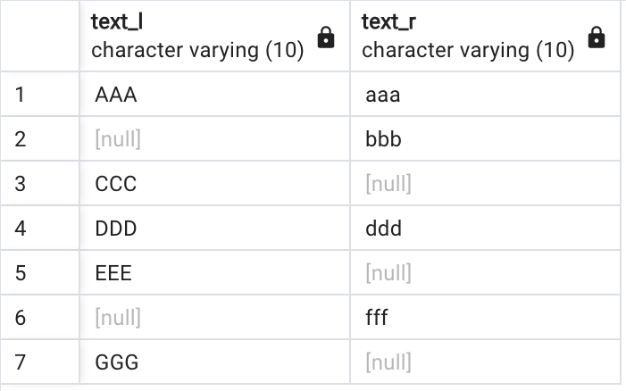

# 2024/03/13 SQL

## 外部結合構文

```
SELECT 列名
FROM テーブル1
LEFT/RIGHT/FULL OUTER JOIN テーブル2
ON テーブル1.キーとなる列名 = テーブル2.キーとなる列名;
```

まず、前提として、、<br>
内部結合は左右のテーブルのON句の条件に一致する行のみを返す。

<b>これに対し、外部結合は左右のテーブルのON句の条件に一致しない行も返す。</b>

外部結合には主に以下の種類がある。
- 左外部結合：左のテーブルの全ての行を返す
- 右外部結合：右のテーブルの全ての行を返す
- 完全外部結合：左右のテーブルの全ての行を返す

    ※データがないところにはNULLが入る

```
(左) ??? OUTER JOIN (右)
```

### 例:

left_table<br>


right_table<br>


#### 内部結合
```
SELECT text_l, text_r 
FROM left_table l 
JOIN right_table r ON l.foreign_key = r.foreign_key;
```


#### 左外部結合
```
SELECT text_l, text_r 
FROM left_table l 
LEFT OUTER JOIN right_table r ON l.foreign_key = r.foreign_key;
```


#### 完全外部結合
```
SELECT text_l, text_r 
FROM left_table l 
FULL OUTER JOIN right_table r ON l.foreign_key = r.foreign_key;
```


### 外部結合を使うシチュエーションの例:

|name|club|
|---|---|
|Jon|1|
|Bob|2|
|Ken|2|
|Joy||
|Mike|1|

|id|club|
|---|---|
|1|soccer|
|2|baseball|

上の表で部活に所属していない生徒も含めて生徒の所属している部活の一覧を出したい時

<br>
<br>

## 集約条件違反

集計関数：SUM、AVG、COUNTなど複数の行のデータを集約する関数<br>
GROUP BY句：データをグループ分けしてそのデータに対して集計をかけることができる<br>

### 例:


全員の点数の平均
```
SELECT AVG(score) FROM student;
```

クラスごとの点数の平均
```
SELECT class, AVG(score) FROM student GROUP BY class;
```


<b>※以下のクエリはエラーになる</b>
```
SELECT id, AVG(score) FROM student GROUP BY class;
```
```
ERROR:  column "student.id" must appear in the GROUP BY clause or be used in an aggregate function
LINE 1: SELECT id, AVG(score) FROM student GROUP BY class;
```

ちなみにこれはいけた（意味ないけど）
```
SELECT id, class, AVG(score) FROM student GROUP BY class, id;
```
<br>

### WHEREとHAVINGの違い:

絞り込むタイミング
- WHEREはGROUP BYで集約する前
- HAVINGはGROUP BYで集約した後

部活がサッカー部の子だけのクラスごとの平均を出したい
```
SELECT class, AVG(score) FROM student WHERE club = 'soccer' GROUP BY class;
```

平均点が370より大きいクラスだけ出したい
```
SELECT class, AVG(score) FROM student GROUP BY class HAVING AVG(score) > 370;
```

以下2つはエラーになる
```
SELECT class, AVG(score) FROM student WHERE AVG(score) > 370 GROUP BY class;
```
```
SELECT class, AVG(score) FROM student GROUP BY class HAVING club = 'soccer';
```
<br>

### 集計関数のNULLの扱い:
集計関数では基本的にNULLの列はカウントしない。<br>
例：列1と2ではAVGで集計した時の結果が変わる<br>
列1: 3/3=1<br>
列2: 3/2=1.5

|列1|列2|
|---|---|
|1|1|
|2|2|
|0|null|

<b>ただし、COUNT(*)のようにCOUNT句でアスタリスクを指定したときはNULLの行もカウントする。</b>

<br>
<br>

## テーブルの正規化

下記のサイトがわかりやすかった。
https://tech.012grp.co.jp/entry/db_normalization

### 第一正規化：1つのカラムに1つの値のみ設定されている状態

### 第二正規化：部分関数従属がない状態    

### 第三正規化：第二正規形のテーブルから、推移的関数従属している列が切り出されたもの

※部分関数従属＝ある非キー属性が、候補キー(主キー、ユニークキー)のー部に関数従属している場合

<br>

```
第一正規化：1つのカラムに1つの値のみ設定されている状態
第二正規化：候補キーの一部→非キー属性の関数従属を排除
第三正規化：非キー属性→非キー属性の関数従属を排除
```
